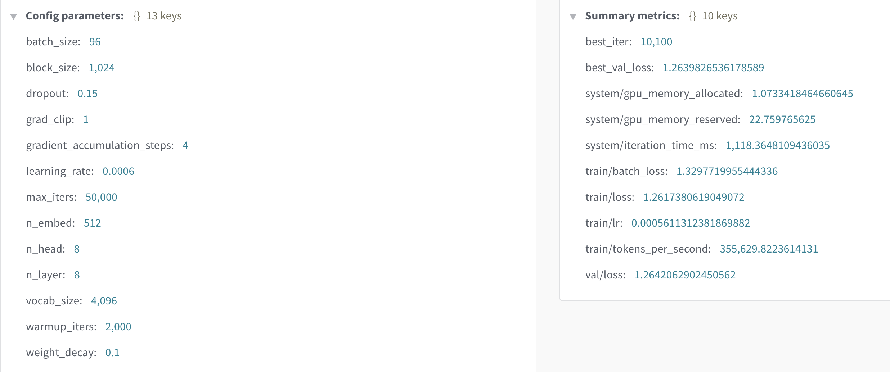

# backgpt & backchat

this is an experiment built on a fork of [smol-gpt](https://github.com/Om-Alve/smolGPT) to train a 'previous word/token' type gpt text generation instead of 'next word/token'. 


### Option 2: Use Pre-trained Model

1. **Download Assets**
```bash
# Download tokenizer
TODO TODO TODO
# wget https://huggingface.co/isaac-art/backgpt/resolve/main/tok4096.model -P data/

# Download pre-trained checkpoint
TODO TODO TODO
# wget https://huggingface.co/isaac-art/backgpt/resolve/main/ckpt.pt -P out/
# 

```

2. **Run Inference**
```bash
python sample.py \
    --prompt "Once upon a time" \
    --tokenizer_path data/tok4096.model \
    --ckpt_path out/ckpt.pt \
    --num_samples 3 \
    --max_new_tokens 200 \
    --temperature 0.7
```

## Pre-trained Model Details 🔍

The provided checkpoint was trained on the [TinyStories](https://huggingface.co/datasets/roneneldan/TinyStories) dataset.

Architecture:
- 4096-token vocabulary
- 8 heads
- 8-layer transformer
- 512 embedding dimension
- Trained for ~4 hours on L40 48GBVRAM - 18 vCPU 251GB RAM

To a Validation Loss of `1.0491`



## Sample Outputs 📝

### Example 1
```text
Prompt: 

Output:
```

```
Prompt: 


Output:
```

## BackChat
BackChat extends the above idea by finetuning on [Dolly15k](https://huggingface.co/datasets/databricks/databricks-dolly-15k) to have a chat like instruction tuned version of the backgpt.

```
Prompt: 

Output:
```

