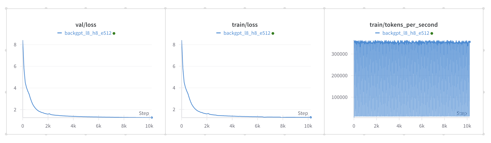

# backgpt & backchat

This is an experiment built on a fork of [smol-gpt](https://github.com/Om-Alve/smolGPT) to train a 'previous word/token' type gpt text generation instead of 'next word/token'. 

## Training Options

### Option 1: TinyStories
A smaller dataset perfect for testing and initial experiments.

1. **Download Assets**
```bash
# Download tokenizer
# The tokenizer vocab size is 4096
# The file size is 65KB
TODO TODO TODO
# wget https://huggingface.co/isaac-art/backgpt/resolve/main/tok4096_tiny.model -P data/

# Download pre-trained checkpoint
# The file size is 327.3MB
TODO TODO TODO
# wget https://huggingface.co/isaac-art/backgpt/resolve/main/best_checkpoint_tiny.pt -P out/checkpoints_tiny/
```

2. **Run Inference**
```bash
python sample.py \
    --dataset tiny \
    --prompt "The end." \
    --num_samples 3 \
    --max_new_tokens 200 \
    --temperature 0.7
```

### Option 2: Fineweb
A large, high-quality dataset from Common Crawl's December 2024 snapshot.

1. **Prepare Dataset**
```bash
# This will:
# 1. Download Fineweb from HuggingFace (~131GB uncompressed)
# 2. Train tokenizer (vocab size 50,257)
# 3. Preprocess and tokenize the data
python preprocess.py prepare-dataset --dataset fineweb --vocab-size 50257
```

2. **Train Model**
```bash
# Train on Fineweb
python train.py --dataset fineweb
```

3. **Run Inference**
```bash
python sample.py \
    --dataset fineweb \
    --prompt "The end." \
    --num_samples 3 \
    --max_new_tokens 200 \
    --temperature 0.8
```

## Model Details 🔍

### TinyStories Model
Trained on the [TinyStories](https://huggingface.co/datasets/roneneldan/TinyStories) dataset.

Architecture:
- 4096-token vocabulary
- 8 heads
- 8-layer transformer
- 512 embedding dimension
- Trained for ~4 hours on L40 48GB VRAM
- Validation Loss: ~1.2



### Fineweb Model
Trained on [Fineweb](https://huggingface.co/datasets/HuggingFaceFW/fineweb), a high-quality web content dataset.

Architecture:
- 50,257-token vocabulary (GPT-2 compatible)
- 8 heads
- 8-layer transformer
- 512 embedding dimension
- Training configuration optimized for L40 48GB VRAM:
  - Batch size: 128
  - Gradient accumulation steps: 3
  - Learning rate: 7e-4
  - Block size: 1024
  - Processing time: ~8-15 hours for dataset preparation
  - Training time: varies by hardware

## Future Work: Instruction Tuning
After training on Fineweb, we'll create an instruction-tuned version (BackChat) similar to our TinyStories-based model, but with enhanced capabilities from the larger, more diverse training data.

## BackChat
BackChat extends the above idea by finetuning to have a chat-like instruction tuned version of the backgpt.

```
Prompt: 

Output:
```

