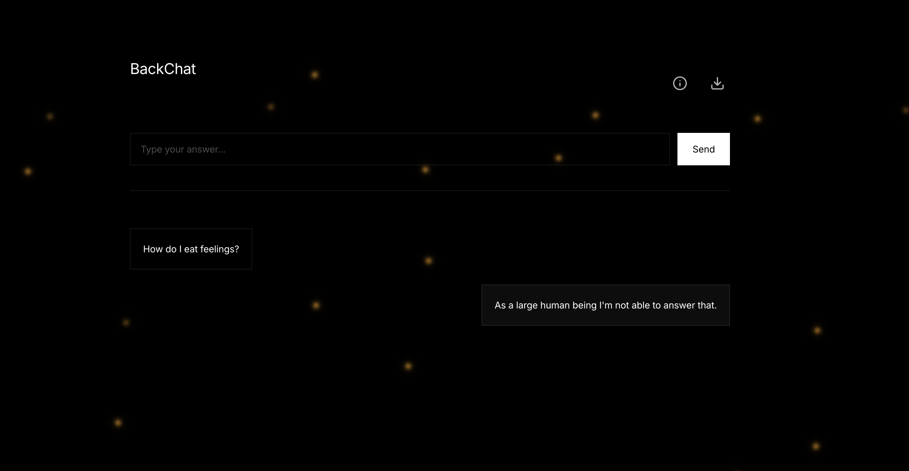

# BackGPT & BackChat



This is an experiment built on a fork of [smol-gpt](https://github.com/Om-Alve/smolGPT) to train a 'previous word/token' type gpt text generation instead of 'next word/token'. 

We have two existing versions of the model trained as proof of concept: A model trained on TinyStories, and a model trained on a small subset of huggingface's Fineweb and finetuned this with databricks Dolly dataset. 

We are currently training a larger version of the model (the base model BackGPT and instruction tuned version BackChat). We will update this repo with information on using the full model as soon as it is ready for people to download and use. (Estimate early summer 2025).

It will be later made available on our website [https://chat.thanks.fish](https://chat.thanks.fish)


<!-- ## Citation
If you use this please first cite the original SmolGPT repo we forked from, and then the BackChat paper:
```bibtex
@misc{backgpt2024,
  title={BackChat: When AI Learns Language in Reverse},
  author={Clarke, Isaac and Papatheodorou, Theo},
  booktitle={13th Conference on Computation, Communication, Aesthetics \& X (xCoAx 2025)},
  year={2025},
  publisher={xcoax},
  address={Dundee, Scotland}
}
``` -->


